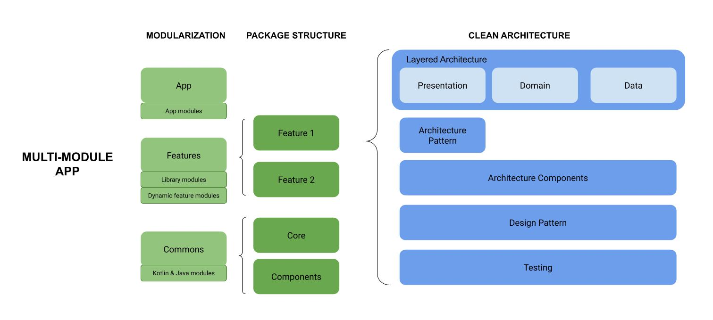

<h1 align="center">Android Architecture Roadmap 🏢</h1>

        
        

Welcome to Android Architecture Roadmap

The main goal of this roadmap is to help anyone who gains knowledge of Android architecture.
This roadmap was an idea after giving a talk to the GDG Cusco community about Android Architecture 
in the real world, resources used are shared below:
- **[Talk: Android Architecture in the real world](https://docs.google.com/presentation/d/1zhMWp0l3Xzxt324TwmSncworTvLwiuTX_Tenj51vTnk/edit?usp=sharing)**

This contains all topics to help you find what you are looking for quickly. I hope I can help you.

## 🗺 Roadmap

        
        

## Contents
- 👍 Good practices
    * [Clean Code](https://www.amazon.com/Clean-Code-Handbook-Software-Craftsmanship/dp/0132350882)
    * [SOLID Principles](https://medium.com/backticks-tildes/the-s-o-l-i-d-principles-in-pictures-b34ce2f1e898)
* 🏛️ Architecture pattern (presentation pattern or UI pattern)
    * [️MVP](https://github.com/antoniolg/androidmvp)
    * MVVM
    * MVI
* 🧱 Architecture components
    * [Android jetpack](https://developer.android.com/jetpack?gclid=CjwKCAjwo7iiBhAEEiwAsIxQEQjRcV1OAX1ExRKSe-zvmtUOawU2oJrLYXxa3crR473Si6zssnfkihoCjeAQAvD_BwE&gclsrc=aw.ds)
    * External libraries
* 🧩 Design patterns
    * [Creational](https://refactoring.guru/es/design-patterns/creational-patterns)
        - Singleton
        - Builder
    * [Structural](https://refactoring.guru/es/design-patterns/structural-patterns)
        - Adapter
        - Composite
    * [Behavioral](https://refactoring.guru/es/design-patterns/behavioral-patterns)
        - Observer
* 🏢 Architecture of system
    * [Clean Arquitecture](https://blog.cleancoder.com/uncle-bob/2012/08/13/the-clean-architecture.html)
        - Domian layer
        - Data layer
            - Patron repository
        - Presentation layer
        - Handle dependencies
            - [Dependency Injection](https://developer.android.com/training/dependency-injection)
* ✅ Quality Assurance
    * [Testing](https://developer.android.com/training/testing)
        - [Unit Test](https://developer.android.com/training/testing/local-tests)
        - [Integration Test](https://developer.android.com/training/testing/fundamentals/test-doubles)
        - [UI Test](https://developer.android.com/training/testing/instrumented-tests/ui-tests)
    * [️Linters](https://en.wikipedia.org/wiki/Lint_(software))
        - [Android Lint](https://developer.android.com/studio/write/lint)
        - Checkstyle
        - PMD
        - FindBugs
    * [️Code Coverage](https://en.wikipedia.org/wiki/Code_coverage)
        - SonarQube
        - JaCoCo
        - Herramienta de cobertura de Android Studio
* 🚀 Multi-Module Apps
    * [️Modularization](https://developer.android.com/topic/modularization)
        - App modules
        - Library modules
        - Kotlin and Java modules
        - Dynamic feature modules
    * [Package structure](https://proandroiddev.com/package-by-type-by-layer-by-feature-vs-package-by-layered-feature-e59921a4dffa)
        - Package by type
        - Package by feature
        - Package by layer
        - Package by module
        - Package by feature on the exterior, and package layer on the interior. (recomended for apps medium or big)
    *  🤖 Modularization + Package Structure
        - App Module   
        - Features Modules 
            - Package by feature on the exterior, and package layer on the interior
        - Commons Modules

## ✍️ Resources
The talk "Android Architecture
in the real world" is based on the following resources:
- **[Book: Real-World Android by Tutorials](https://www.kodeco.com/books/real-world-android-by-tutorials)**
- **[Book: Android Test-Driven Development by Tutorials](https://www.kodeco.com/books/android-test-driven-development-by-tutorials)**
- **[Book: Advanced Android App Architecture](https://www.kodeco.com/books/advanced-android-app-architecture)**

## 💡 Inspiration
This project is inspired by [Mobile Developer Security Roadmap ](https://github.com/rviannaoliveira/mobile-developer-security-roadmap), [Android Developer Roadmap 2022](https://github.com/skydoves/android-developer-roadmap/blob/main/README.md). So thank you for the authors providing the roadmap ideas. Also, you can learn a lot of knowledge from the repositories.

## 🚦 Wrap Up
If you have an idea to improve the map, feel free to discuss it in the issues.

## Find this project useful? :heart:

Support it by joining __[stargazers](https://github.com/FahedHermoza/android-architecture-roadmap/stargazers)__ for this repository. :star:  
And __[follow](https://www.linkedin.com/in/fahedhermoza/)__ me for my next creations! 🤩

License
-------

    Copyright 2023 Fahed Hermoza

    Licensed under the Apache License, Version 2.0 (the "License");
    you may not use this file except in compliance with the License.
    You may obtain a copy of the License at

    http://www.apache.org/licenses/LICENSE-2.0

    Unless required by applicable law or agreed to in writing, software
    distributed under the License is distributed on an "AS IS" BASIS,
    WITHOUT WARRANTIES OR CONDITIONS OF ANY KIND, either express or implied.
    See the License for the specific language governing permissions and
    limitations under the License.